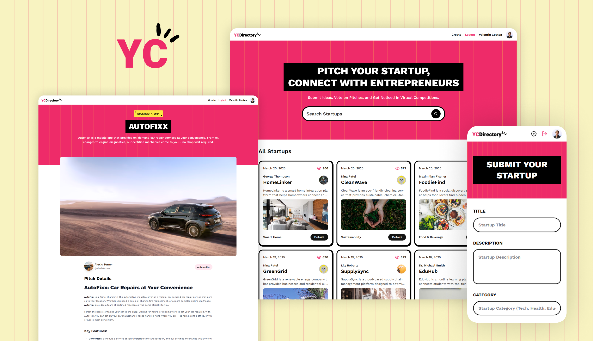

# YC Directory
> A modern [Next.js](https://nextjs.org/) web application for creating a directory of startups, built with React, TypeScript, and Tailwind CSS.


---

## 📸 Preview

<!-- Replace with an actual screenshot or GIF -->


---

## ✨ Features

- **Startup Submission:** Users can pitch their startups by submitting a form.
- **CRUD Functionality:** Create and Read functionality for startup pitches.
- **View Tracking:** Tracks the number of views for each startup.
- **User Profiles:** View user profiles with a list of their submitted startups.
- **Search Functionality:** Search for startups in the directory.
- **User Authentication:** Secure user authentication with NextAuth.js.
- **Responsive Design:** Fully accessible on desktop and mobile devices.

---

## 🚀 Live Demo

Check out the live version here:
**[🔗 Live Project](https://yc-directory-jkv21.vercel.app/)**

---

## 🛠️ Tech Stack

- **Framework:** [Next.js](https://nextjs.org/) `^15`
- **UI Library:** [React](https://react.dev/) `19`
- **Language:** [TypeScript](https://www.typescriptlang.org/) `^5`
- **Styling:** [Tailwind CSS](https://tailwindcss.com/) `^3.4.1`
- **CMS:** [Sanity.io](https://www.sanity.io/) `^3.62.3`
- **Authentication:** [NextAuth.js](https://next-auth.js.org/) `^5.0.0-beta.25`
- **Deployment:** [Vercel](https://vercel.com/)

---

## 📁 Project Structure

```bash
├─ app/                # Next.js App Router pages & API routes
│  ├─ (root)/          # Root layout and pages
│  ├─ api/             # API routes
│  └─ studio/          # Sanity Studio
├─ components/         # Reusable UI components
├─ hooks/              # Custom React hooks
├─ lib/                # Utility functions / helpers
├─ public/             # Static assets (images, icons, etc.)
├─ sanity/             # Sanity.io configuration and schema
└─ ...
```

---

## ⚙️ Getting Started

### ✅ Prerequisites

* Node.js (v18.x or later)
* npm / yarn / pnpm

### 🧰 Installation

1. Clone the repository:

   ```bash
   git clone https://github.com/jkvdev/yc_directory.git
   ```
2. Navigate to the project directory:

   ```bash
   cd yc_directory
   ```
3. Install the dependencies:

   ```bash
   npm install
   ```

### 🔐 Environment Variables

This project requires environment variables. Create a `.env.local` file in the root and add:

```env
NEXT_PUBLIC_SANITY_PROJECT_ID="your_sanity_project_id"
NEXT_PUBLIC_SANITY_DATASET="your_sanity_dataset"
NEXT_PUBLIC_SANITY_API_VERSION="your_sanity_api_version"
SANITY_WRITE_TOKEN="your_sanity_write_token"
NEXTAUTH_SECRET="your_secret_key"
NEXTAUTH_URL="http://localhost:3000"
```

### ▶️ Running the Development Server

```bash
npm run dev
```

Visit [http://localhost:3000](http://localhost:3000) to view it in your browser.

---

## 💡 Key Learnings & Challenges

* Used **server-side rendering (SSR)** and **static site generation (SSG)** for optimal performance.
* Implemented the new **Partial Pre-rendering (PPR)** feature for optimal performance on dynamic pages.
* Integrated a **headless CMS (Sanity.io)** to manage dynamic content.
* Secured the application with **NextAuth.js** for user authentication.
* Focused on accessibility and responsive design across devices.

---

## 🗺️ Roadmap

* [ ] Implement Update and Delete functionality for startup pitches
* [ ] Add dark mode support
* [ ] Improve Lighthouse performance score
* [ ] Add unit and integration tests
* [ ] Expand API integrations

---

## 📝 License

This project is licensed under the MIT License. See the [LICENSE](LICENSE) file for details.

---

## 📬 Contact

**Valentin Costea** – [Portfolio](https://jkvdev.com) – [jkv21contact@gmail.com](mailto:jkv21contact@gmail.com)